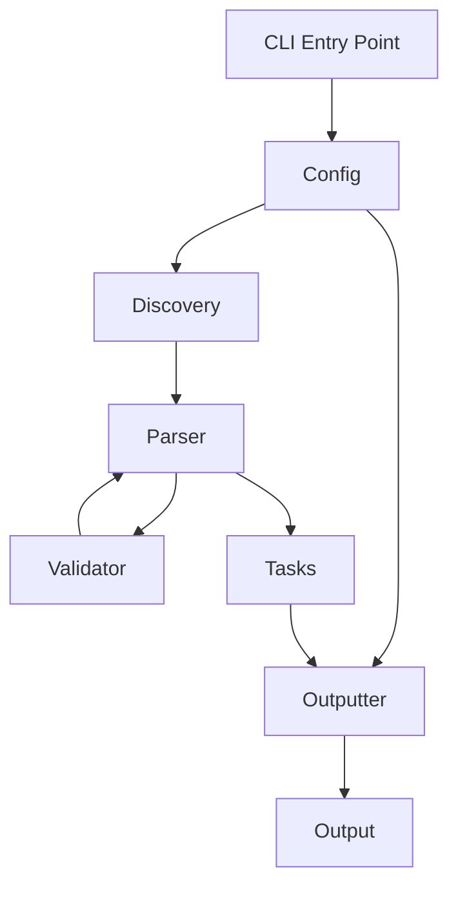

# Architecture

taskfile-help is designed with simplicity and performance in mind. It uses a modular architecture with clear separation of concerns.

## Overview



## Components

### 1. Entry Point (`taskfile_help.py`)

The main entry point that orchestrates the application flow:

- Parses command-line arguments
- Initializes configuration
- Selects appropriate outputter
- Coordinates task discovery and parsing
- Handles error cases

**Key Function**: `main(argv: list[str] | None = None) -> int`

### 2. Configuration (`config.py`)

Manages application configuration from multiple sources:

- Command-line arguments (via `argparse`)
- `pyproject.toml` configuration file
- Default values

**Classes**:

- `Args`: Parsed command-line arguments
- `Config`: Combined configuration with derived values

**Features**:

- TTY detection for color support
- Search directory resolution
- Configuration priority handling
- Two-pass argument parsing for flexible global option positioning

#### Two-Pass Argument Parsing

The argument parser uses a two-pass approach to allow global options to appear before or after subcommands:

**First Pass**: Parse global options only

```python
global_parser = argparse.ArgumentParser(add_help=False)
Args._add_global_arguments(global_parser, Args._list_of_paths)
global_args, remaining_argv = global_parser.parse_known_args(argv[1:])
```

**Second Pass**: Parse complete command with subcommands

```python
command_parser = argparse.ArgumentParser(...)
Args._add_global_arguments(command_parser, Args._list_of_paths)
# Add subparsers for namespace and search commands
command_args = command_parser.parse_args(argv[1:])
```

This allows flexible command structures:

- `taskfile-help --json namespace dev` (options before)
- `taskfile-help namespace dev --json` (options after)
- `taskfile-help --json namespace dev --verbose` (mixed)

### 3. Discovery (`discovery.py`)

Handles Taskfile discovery across search paths:

- Finds main Taskfile (matches `[Tt]askfile\.ya?ml`)
- Finds namespace Taskfiles (matches `[Tt]askfile[-_](?P<namespace>\w+)\.ya?ml`)
- Searches multiple directories
- Returns first match (priority-based)

**Class**: `TaskfileDiscovery`

**Methods**:

- `find_main_taskfile() -> Path | None`
- `find_namespace_taskfile(namespace: str) -> Path | None`
- `get_all_namespace_taskfiles() -> list[tuple[str, Path]]`
- `get_possible_paths(namespace: str) -> list[Path]`

### 4. Validator (`validator.py`)

Validates Taskfile structure and content:

- Parses YAML with `yaml.safe_load()`
- Validates version field (must be '3')
- Validates tasks section structure
- Validates individual task fields
- Reports warnings but allows processing to continue

**Key Function**: `validate_taskfile(lines: list[str], outputter: Outputter) -> bool`

**Returns**: `True` if valid, `False` if warnings were issued

**Validation Checks**:

- Root is a dictionary
- Version field exists and equals `'3'` (string)
- Tasks section exists and is a dictionary
- Each task is a dictionary
- Field type validation:
  - `desc`: string
  - `internal`: boolean
  - `cmds`: list or string
  - `deps`: list

**Behavior**:

- Always enabled (no opt-in required)
- Non-fatal (warnings only)
- Runs before line-by-line parsing
- Minimal performance impact (~1-2ms per file)

### 5. Parser (`parser.py`)

Line-by-line Taskfile parser (not a full YAML parser):

- Validates Taskfile structure first (calls validator)
- Extracts task names and descriptions
- Identifies group markers (`# === Group Name ===`)
- Detects internal tasks (`internal: true`)
- Preserves task order

**Key Function**: `parse_taskfile(filepath: Path, namespace: str, outputter: Outputter) -> list[tuple[str, str, str]]`

**Returns**: List of `(group, task_name, description)` tuples

**Helper Functions**:

- `_extract_task_name(line: str) -> str | None`
- `_extract_description(line: str) -> str | None`
- `_is_internal_task(line: str) -> bool`
- `_save_task_if_valid(...) -> None`

### 6. Output (`output.py`)

Handles output formatting with multiple strategies:

**Protocol**: `Outputter`

- Defines interface for output implementations
- Methods: `output_single()`, `output_all()`, `output_error()`, etc.

**Implementations**:

#### TextOutputter

- Colored terminal output
- Group headers with formatting
- Task list with descriptions
- Respects color settings

#### JsonOutputter

- Structured JSON output
- Task metadata (group, name, full_name, description)
- No color codes
- Machine-readable format

**Color Management**: `Colors` class

- ANSI color codes
- Global enable/disable
- TTY-aware

## Data Flow

### 1. Initialization

```python
# Parse arguments and load config
config = Config(argv)

# Select outputter
outputter = JsonOutputter() if config.args.json_output else TextOutputter()

# Disable colors if needed
if not config.colorize or config.args.json_output:
    Colors.disable()
```

### 2. Discovery

```python
# Find Taskfile
if namespace:
    taskfile = config.discovery.find_namespace_taskfile(namespace)
else:
    taskfile = config.discovery.find_main_taskfile()
```

### 3. Parsing

```python
# Parse tasks
tasks = parse_taskfile(taskfile, namespace, outputter)
# Returns: [(group, task_name, description), ...]
```

### 4. Output

```python
# Display results
outputter.output_single(namespace, tasks)
```

## Design Decisions

### Why Not Full YAML Parser?

- **Performance**: Line-by-line parsing is faster
- **Simplicity**: No external dependencies
- **Sufficient**: Only need task names and descriptions
- **Robust**: Handles malformed YAML gracefully

### Why Protocol-Based Outputters?

- **Extensibility**: Easy to add new output formats
- **Testability**: Mock outputters for testing
- **Separation**: Output logic separate from business logic
- **Type Safety**: Protocol ensures interface compliance

### Why Multiple Search Directories?

- **Flexibility**: Support shared task libraries
- **Monorepos**: Search across multiple projects
- **Reusability**: Common tasks in shared locations
- **Priority**: First match wins (explicit ordering)

### Why Namespace Support?

- **Organization**: Separate concerns (dev, test, deploy)
- **Clarity**: Clear task ownership
- **Scalability**: Large projects with many tasks
- **Modularity**: Independent Taskfile management

## Error Handling

### Graceful Degradation

- Missing Taskfile: Clear error message with tried paths
- Parse errors: Log warning, continue processing
- Invalid namespace: Suggest available namespaces
- No tasks found: Empty output (not an error)

### Exit Codes

- `0`: Success
- `1`: Error (Taskfile not found, invalid namespace, etc.)

## Testing Strategy

### Unit Tests

- Individual function testing
- Mock dependencies
- Edge case coverage
- Fast execution

### End-to-End Tests

- Full CLI invocation
- Subprocess testing
- Real Taskfile parsing
- Integration verification

### Test Organization

```text
tests/
├── unit/           # Unit tests
│   ├── test_config.py
│   ├── test_discovery.py
│   ├── test_output.py
│   ├── test_parser.py
│   └── test_taskfile_help.py
└── e2e/            # End-to-end tests
    └── test_cli.py
```

## Performance Characteristics

- **Startup**: < 50ms (no heavy dependencies)
- **Parsing**: O(n) where n = number of lines
- **Memory**: Minimal (streaming line-by-line)
- **Disk I/O**: Single file read per Taskfile

## Future Extensibility

Potential enhancements:

1. **Additional Output Formats**: XML, YAML, Markdown
2. **Caching**: Cache parsed results for large Taskfiles
3. **Validation**: Validate Taskfile structure
4. **Auto-completion**: Shell completion support
5. **Task Dependencies**: Show task dependency graph
