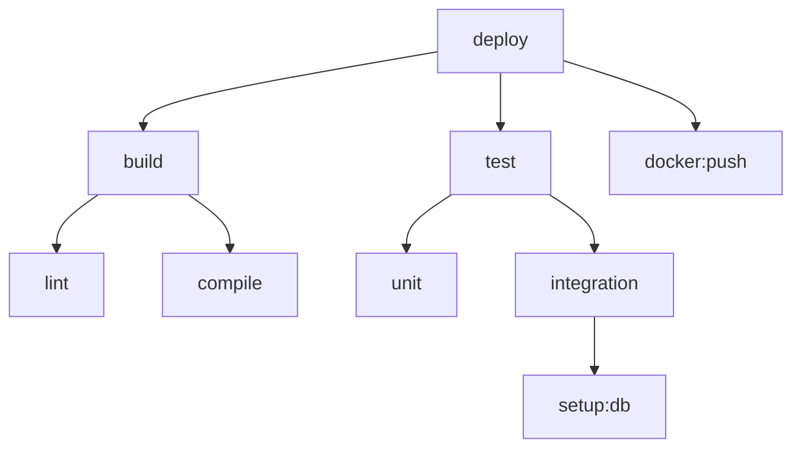

# Task Dependencies Implementation Plan

## Overview

Add support for displaying task dependencies, showing which tasks depend on other tasks. Support multiple
output formats and depth levels.

## Requirements

- **Flag**: `--dependencies` to enable dependency display
- **Output formats**:
  - Text (default): ASCII tree format
  - JSON: `--json` flag
  - Mermaid: `--mermaid` flag
- **Depth control**:
  - Direct dependencies (default): Show only immediate deps
  - Full graph: `--full-graph` flag shows complete dependency tree
- **Target**: Show dependencies for specific task or all tasks

## Implementation Checklist

### Phase 1: Dependency Parsing

- [ ] Extend `parser.py` to extract dependencies:
  - [ ] Add `deps` field extraction to task parsing
  - [ ] Return task data structure with dependencies
  - [ ] Handle both list and single string deps format
  - [ ] Parse task references (including namespace prefixes)

- [ ] Create `src/taskfile_help/dependencies.py` module:
  - [ ] `TaskNode` dataclass for dependency graph nodes
  - [ ] `DependencyGraph` class for managing task relationships
  - [ ] `build_dependency_graph(tasks: list) -> DependencyGraph`

### Phase 2: Dependency Graph Building

- [ ] Implement `DependencyGraph` class:
  - [ ] `add_task(name: str, deps: list[str])`
  - [ ] `get_dependencies(task: str, recursive: bool = False) -> list[str]`
  - [ ] `get_dependents(task: str) -> list[str]` (reverse lookup)
  - [ ] `detect_cycles() -> list[list[str]]` (circular dependency detection)
  - [ ] `topological_sort() -> list[str]` (execution order)

### Phase 3: Text Output Format

- [ ] Implement ASCII tree formatter:
  - [ ] `format_tree(task: str, graph: DependencyGraph, full: bool) -> str`
  - [ ] Use tree characters: `├──`, `└──`, `│`
  - [ ] Show direct dependencies by default
  - [ ] Show full tree with `--full-graph`
  - [ ] Indicate circular dependencies with `[CIRCULAR]`

- [ ] Example output:
  
  ```text
  deploy
  ├── build
  │   ├── lint
  │   └── test
  │       └── unit
  └── docker:push
      └── docker:build
  ```

### Phase 4: JSON Output Format

- [ ] Implement JSON formatter:
  - [ ] `format_json(task: str, graph: DependencyGraph, full: bool) -> dict`
  - [ ] Structure:

    ```json
    {
      "task": "deploy",
      "dependencies": [
        {
          "task": "build",
          "dependencies": [
            {"task": "lint", "dependencies": []},
            {"task": "test", "dependencies": [...]}
          ]
        },
        {
          "task": "docker:push",
          "dependencies": [...]
        }
      ]
    }
    ```

  - [ ] Include metadata: depth, circular flag

### Phase 5: Mermaid Output Format

- [ ] Implement Mermaid diagram formatter:
  - [ ] `format_mermaid(task: str, graph: DependencyGraph, full: bool) -> str`
  - [ ] Generate flowchart syntax
  - [ ] Use `-->` for dependencies
  - [ ] Style circular dependencies differently
  - [ ] Support both LR (left-right) and TD (top-down) layouts

- [ ] Example output:

  ```mermaid
  graph TD
    deploy --> build
    deploy --> docker:push
    build --> lint
    build --> test
    test --> unit
    docker:push --> docker:build
  ```

### Phase 6: CLI Integration

- [ ] Add command-line arguments:
  - [ ] `--dependencies [TASK]` - Show dependencies for task (or all if omitted)
  - [ ] `--full-graph` - Show complete dependency tree
  - [ ] `--mermaid` - Output in Mermaid format
  - [ ] Combine with existing `--json` flag

- [ ] Modify `taskfile_help.py`:
  - [ ] Parse new flags
  - [ ] Build dependency graph from parsed tasks
  - [ ] Format output based on flags
  - [ ] Handle missing task errors

### Phase 7: Cross-Namespace Dependencies

- [ ] Support namespace-prefixed dependencies:
  - [ ] Parse `namespace:task` format in deps
  - [ ] Load tasks from multiple namespaces
  - [ ] Build unified dependency graph
  - [ ] Show namespace in output: `dev:test`

### Phase 8: Error Handling

- [ ] Handle edge cases:
  - [ ] Missing dependency task (show warning)
  - [ ] Circular dependencies (detect and warn)
  - [ ] Invalid task name format
  - [ ] Empty dependency list
  - [ ] Task not found

### Phase 9: Testing

- [ ] Unit tests for `dependencies.py`:
  - [ ] Test `DependencyGraph` operations
  - [ ] Test cycle detection
  - [ ] Test topological sort
  - [ ] Test tree building (direct and full)

- [ ] Unit tests for formatters:
  - [ ] Test text tree formatting
  - [ ] Test JSON formatting
  - [ ] Test Mermaid formatting
  - [ ] Test with circular dependencies
  - [ ] Test with cross-namespace deps

- [ ] Integration tests:
  - [ ] Test with real Taskfiles
  - [ ] Test `--dependencies` flag
  - [ ] Test `--full-graph` flag
  - [ ] Test output format combinations

- [ ] E2E tests:
  - [ ] Test CLI with dependencies
  - [ ] Test error messages
  - [ ] Test all output formats

### Phase 10: Documentation

- [ ] Create `docs/features/dependencies.md`:
  - [ ] Usage examples for each format
  - [ ] Explanation of direct vs full graph
  - [ ] Cross-namespace dependencies
  - [ ] Circular dependency handling

- [ ] Update `README.md`:
  - [ ] Add "Task Dependencies" section
  - [ ] Show example outputs

- [ ] Update `--help` output:
  - [ ] Document `--dependencies` flag
  - [ ] Document `--full-graph` flag
  - [ ] Document `--mermaid` flag

## Code Structure

```text
src/taskfile_help/
├── dependencies.py       # NEW: Dependency graph logic
├── parser.py             # MODIFIED: Extract deps field
├── taskfile_help.py      # MODIFIED: Add dependency flags
└── output.py             # MODIFIED: Add dependency formatters

tests/
├── unit/
│   ├── test_dependencies.py  # NEW: Dependency tests
│   └── test_parser.py         # MODIFIED: Test deps parsing
└── e2e/
    └── test_cli.py            # MODIFIED: Add dependency tests

docs/
└── features/
    └── dependencies.md        # NEW: Dependency documentation
```

## Example Implementation

### dependencies.py

```python
"""Task dependency graph management."""

from dataclasses import dataclass, field
from typing import Optional


@dataclass
class TaskNode:
    """Represents a task in the dependency graph."""
    name: str
    namespace: str = ""
    dependencies: list[str] = field(default_factory=list)
    
    @property
    def full_name(self) -> str:
        """Get fully qualified task name."""
        return f"{self.namespace}:{self.name}" if self.namespace else self.name


class DependencyGraph:
    """Manages task dependency relationships."""
    
    def __init__(self):
        self.tasks: dict[str, TaskNode] = {}
    
    def add_task(self, name: str, namespace: str = "", deps: list[str] = None):
        """Add a task to the graph."""
        full_name = f"{namespace}:{name}" if namespace else name
        self.tasks[full_name] = TaskNode(name, namespace, deps or [])
    
    def get_dependencies(self, task: str, recursive: bool = False) -> list[str]:
        """Get dependencies for a task.
        
        Args:
            task: Task name (optionally namespace-prefixed)
            recursive: If True, get all transitive dependencies
            
        Returns:
            List of dependency task names
        """
        if task not in self.tasks:
            return []
        
        node = self.tasks[task]
        deps = node.dependencies.copy()
        
        if recursive:
            # Get transitive dependencies
            visited = set()
            to_visit = deps.copy()
            
            while to_visit:
                current = to_visit.pop(0)
                if current in visited or current not in self.tasks:
                    continue
                
                visited.add(current)
                current_deps = self.tasks[current].dependencies
                
                for dep in current_deps:
                    if dep not in deps:
                        deps.append(dep)
                    if dep not in visited:
                        to_visit.append(dep)
        
        return deps
    
    def detect_cycles(self) -> list[list[str]]:
        """Detect circular dependencies.
        
        Returns:
            List of cycles, where each cycle is a list of task names
        """
        cycles = []
        visited = set()
        rec_stack = set()
        
        def visit(task: str, path: list[str]) -> bool:
            """DFS to detect cycles."""
            if task in rec_stack:
                # Found a cycle
                cycle_start = path.index(task)
                cycles.append(path[cycle_start:] + [task])
                return True
            
            if task in visited:
                return False
            
            visited.add(task)
            rec_stack.add(task)
            
            if task in self.tasks:
                for dep in self.tasks[task].dependencies:
                    visit(dep, path + [task])
            
            rec_stack.remove(task)
            return False
        
        for task in self.tasks:
            if task not in visited:
                visit(task, [])
        
        return cycles
    
    def format_tree(self, task: str, full: bool = False, prefix: str = "", is_last: bool = True) -> list[str]:
        """Format dependency tree as text.
        
        Args:
            task: Root task name
            full: If True, show all transitive dependencies
            prefix: Current indentation prefix
            is_last: Whether this is the last sibling
            
        Returns:
            List of formatted lines
        """
        lines = []
        
        if not prefix:
            # Root task
            lines.append(task)
        
        if task not in self.tasks:
            return lines
        
        deps = self.get_dependencies(task, recursive=full)
        
        for i, dep in enumerate(deps):
            is_last_dep = (i == len(deps) - 1)
            connector = "└── " if is_last_dep else "├── "
            lines.append(f"{prefix}{connector}{dep}")
            
            if full and dep in self.tasks:
                extension = "    " if is_last_dep else "│   "
                sub_lines = self.format_tree(dep, full, prefix + extension, is_last_dep)
                lines.extend(sub_lines[1:])  # Skip the root line
        
        return lines


def build_dependency_graph(tasks: list[tuple[str, str, str, list[str]]]) -> DependencyGraph:
    """Build dependency graph from parsed tasks.
    
    Args:
        tasks: List of (group, task_name, description, dependencies) tuples
        
    Returns:
        DependencyGraph instance
    """
    graph = DependencyGraph()
    
    for group, task_name, desc, deps in tasks:
        # Parse namespace from task name if present
        if ':' in task_name:
            namespace, name = task_name.split(':', 1)
        else:
            namespace, name = "", task_name
        
        graph.add_task(name, namespace, deps)
    
    return graph
```

### Modified parser.py

```python
def parse_taskfile(filepath: Path, namespace: str, outputter: Outputter) -> list[tuple[str, str, str, list[str]]]:
    """Parse a Taskfile and extract public tasks with their descriptions and dependencies.
    
    Returns:
        List of (group, task_name, description, dependencies) tuples
    """
    tasks: list[tuple[str, str, str, list[str]]] = []
    current_group = "Other"
    current_task = None
    current_desc = None
    current_deps: list[str] = []
    is_internal = False
    in_tasks_section = False
    in_deps_section = False
    
    # ... existing parsing logic ...
    
    # Add dependency parsing
    if current_task and line.strip().startswith("deps:"):
        in_deps_section = True
        # Check for inline list: deps: [task1, task2]
        if '[' in line:
            deps_str = line.split('[', 1)[1].split(']', 0)[0]
            current_deps = [d.strip().strip('"\'') for d in deps_str.split(',')]
            in_deps_section = False
        continue
    
    if in_deps_section:
        # Multi-line deps list
        if line.strip().startswith('- '):
            dep = line.strip()[2:].strip().strip('"\'')
            current_deps.append(dep)
        elif not line.strip().startswith(' '):
            in_deps_section = False
    
    # ... rest of parsing ...
    
    # Modified save function to include deps
    def _save_task_if_valid(...):
        if current_task and current_desc and not is_internal:
            full_name = f"{namespace}:{current_task}" if namespace else current_task
            tasks.append((current_group, full_name, current_desc, current_deps.copy()))
```

### CLI Usage Examples

```bash
# Show dependencies for a specific task (direct only)
taskfile-help --dependencies deploy

# Show full dependency tree for a task
taskfile-help --dependencies deploy --full-graph

# Show dependencies in JSON format
taskfile-help --dependencies deploy --json

# Show dependencies as Mermaid diagram
taskfile-help --dependencies deploy --mermaid

# Show all task dependencies
taskfile-help --dependencies

# Combine with namespace
taskfile-help dev --dependencies test
```

### Output Examples

#### Text (Direct)

```text
deploy
├── build
├── test
└── docker:push
```

#### Text (Full Graph)

```text
deploy
├── build
│   ├── lint
│   └── compile
└── test
    ├── unit
    └── integration
        └── setup:db
```

#### JSON

```json
{
  "task": "deploy",
  "dependencies": [
    {
      "task": "build",
      "dependencies": [
        {"task": "lint", "dependencies": []},
        {"task": "compile", "dependencies": []}
      ]
    },
    {
      "task": "test",
      "dependencies": [
        {"task": "unit", "dependencies": []},
        {
          "task": "integration",
          "dependencies": [
            {"task": "setup:db", "dependencies": []}
          ]
        }
      ]
    }
  ],
  "circular": false
}
```

#### Mermaid



## Performance Considerations

- **Graph building**: O(n) where n = number of tasks
- **Cycle detection**: O(n + e) where e = number of edges
- **Tree traversal**: O(n) for direct, O(n²) worst case for full graph
- **Memory**: O(n + e) for graph storage

## Success Criteria

- [ ] Dependencies are correctly parsed from Taskfiles
- [ ] Text tree output is readable and accurate
- [ ] JSON output is valid and complete
- [ ] Mermaid diagrams render correctly
- [ ] Circular dependencies are detected and reported
- [ ] Cross-namespace dependencies work
- [ ] `--full-graph` shows complete tree
- [ ] Performance is acceptable (< 100ms for typical Taskfiles)
- [ ] Documentation is complete with examples
